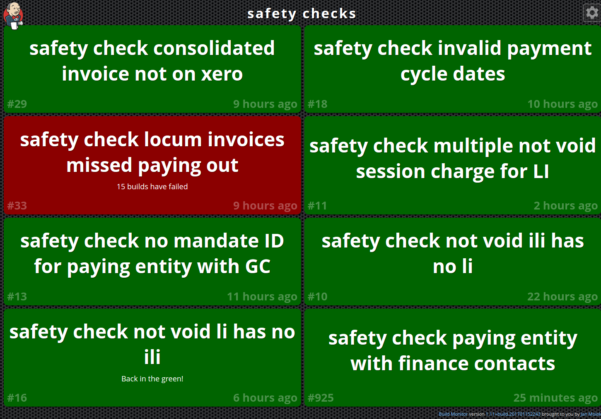

# Jenkins alert 
This python script for Raspberry PI will enable and disable a GPIO pin OUT everytime one of the 
jenkins task is failing (once every hour, for 5 seconds), allowing us to activate a relay connected to a 12V warning rotating light to notify us that those tasks are failing. 



## Hardware setup 

TODO 

## Jenkins setup 

Create your jenkins api key on your configure page on jenkins 

https://jenkins.networklocum.com/user/rephus/configure

Add your username and token to settings.py file

## Run

Run this on Raspberry Pi, with GPIO libraries installed
```
pip install -r requirements.txt
python app.py
``` 


## Documentation 

* Jenkins doc: https://wiki.jenkins-ci.org/display/JENKINS/Remote+access+API
* Jenkins api sample : https://gist.github.com/joepadmiraal/33e0c2a7a7b00cc2e0aa